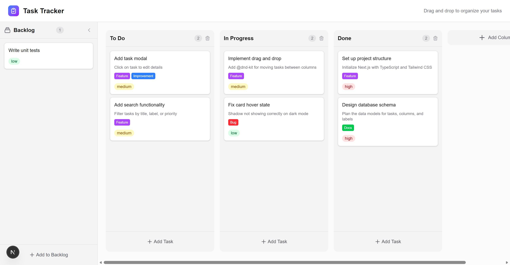

# Task Tracker

A Kanban-style task management board built with Next.js, TypeScript, and Tailwind CSS.



## Features

- **Drag & drop** tasks between columns
- **Backlog** sidebar for unassigned tasks
- **Labels** with custom colors
- **Priority levels** (low, medium, high)
- **Task details modal** for editing
- **Persistent storage** via localStorage

## Tech Stack

- Next.js 16 (App Router)
- TypeScript
- Tailwind CSS
- Zustand (state management)
- @dnd-kit (drag and drop)

## Run Locally

```bash
npm install
npm run dev
```

Open [http://localhost:3000](http://localhost:3000)
